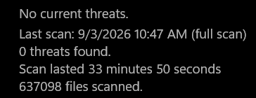
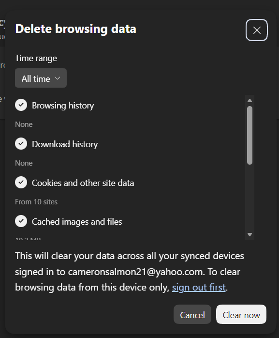
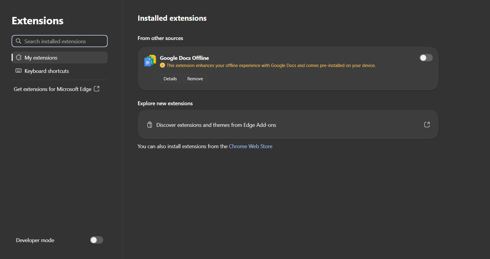
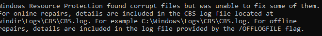
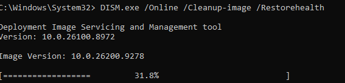
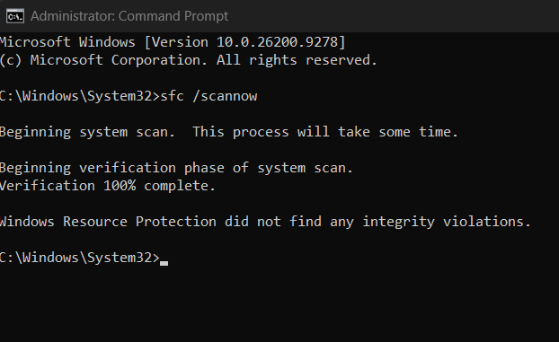

# Incident Report: Typo-Squatting and Scareware Encounter

| | |
|---|---|
| **Incident date** | September 3, 2026 |
| **Report date** | September 3, 2026 (updated September 4, 2026) |
| **Classification** | Scareware via typo-squatted domain |
| **Severity** | Low — no payload executed, no malware detected |
| **Status** | Resolved |

---

## Summary

A mistyped URL resolved to a typo-squatted domain hosting scareware. The page rendered
multiple overlapping fake security alerts impersonating Norton and McAfee, using urgent
language and warning styling to pressure the user into clicking.

No buttons were clicked. The tab was closed via Task Manager, and a full remediation and
verification pass was performed: Windows Defender full scan, browser data and extension
review, and Windows system file repair. No malware was found on the system.

---

## Indicators

**Malicious domain**

```
dac79p9s66ac73adjlm0.rehit[.]co[.]in
```

*Defanged. Do not visit.*

The subdomain is a long random string on a low-reputation TLD — a common pattern for
disposable scareware hosting, where operators cycle subdomains faster than blocklists
can keep up.

**Intended destination:** `tutorialspoint.com`

**Observed behavior**

- Fake Norton alert: "Your Norton Is No Longer Active" with a "RENEW NORTON" button
- Fake McAfee alert: "Critical Virus Alert" with "Delete Viruses" and "Open Antivirus" buttons
- Multiple overlapping windows, apparently intended to induce panic and make dismissal
  harder than compliance


---

## Timeline

| Time | Event |
|---|---|
| 10:43 | URL for `tutorialspoint.com` mistyped; browser resolves to typo-squatted domain |
| 10:45 | Fake security alerts render |
| 10:46 | Tab closed via Task Manager — no buttons clicked |
| 10:47 | Windows Defender full system scan initiated |
| 11:04 | Defender scan completes — no threats detected |
| 11:08 | Browser cache, cookies, and site settings cleared (all time) |
| 11:19 | Browser extensions reviewed — no unauthorized additions found |
| 11:21 | `sfc /scannow` initiated |
| 11:22 | `DISM /online /cleanup-image /restorehealth` initiated |
| 12:15 | Repairs complete |
| Sept 4, 15:35 | `sfc /scannow` re-run following DISM — no integrity violations found |

---

## Response

### 1. Containment

The tab was closed through Task Manager rather than the browser's own close button.
Scareware pages frequently trap the window with dialog loops or `onbeforeunload` handlers,
so terminating the process is the reliable exit. No alert button was clicked at any point.

### 2. Malware scan

A full Windows Defender scan was run rather than a quick scan, on the reasoning that a
quick scan checks common infection paths only and would not rule out a drive-by download
written elsewhere on disk.

**Result: no threats detected.**



### 3. Browser remediation

Cleared cookies, cached files, and site settings with the range set to all time. Site
settings matter specifically here — a scareware page that has been granted notification
permission can continue pushing alerts after the tab is gone, and clearing cache alone
would not revoke that.



Reviewed installed extensions for unauthorized additions.

**Result: none found.**



### 4. System file verification

```
sfc /scannow
```

System File Checker verifies protected Windows system files against known-good copies in
the local component store and repairs mismatches.

**Result: corrupt files found; some could not be repaired.**



```
DISM /online /cleanup-image /restorehealth
```

- `/online` — targets the running Windows installation rather than a mounted offline image
- `/cleanup-image` — operates on the component store
- `/restorehealth` — repairs the component store itself, pulling clean sources from Windows Update

**Result: completed successfully.**



**Why this order matters:** SFC repairs system files *using* the component store. If the
store is itself damaged, SFC has no clean source to restore from and reports files it
cannot fix — which is what happened here. DISM `/restorehealth` repairs the store, so the
correct sequence is DISM first, then SFC.

### 5. Post-repair verification

Because the initial SFC pass ran before the component store was repaired, its results
could not be treated as conclusive. SFC was re-run after DISM completed:

```
sfc /scannow
```

**Result: Windows Resource Protection did not find any integrity violations.**



This confirms the component store repair succeeded and the files the first pass could not
fix are now intact. Without this step, the earlier "could not repair" result would have
remained an open item.

---

## Analysis

**Root cause.** A single-character typo in a manually entered URL. The domain was
registered specifically to catch that class of mistake.

**Why it did not escalate.** Scareware relies entirely on the user taking an action —
clicking a button, calling a number, installing a "fix." It has no exploit component. The
attack failed at the only step that mattered, which was the decision not to click.

**On the SFC result.** The corrupt files reported by the first SFC pass are unlikely to be
attributable to this incident. No payload executed, Defender found nothing, and no button
was clicked, so there is no plausible mechanism by which the page corrupted system files.
Pre-existing component store damage is the more probable explanation, and the scan
surfaced it incidentally. The clean result on re-verification is consistent with that
reading: DISM repaired damage that predated the incident.

---

## Prevention

| Control | Rationale |
|---|---|
| Bookmark frequently visited sites | Removes manual typing as an attack surface entirely |
| Content blocker (uBlock Origin) | Blocks the alert rendering before it displays |
| Browser pop-up blocking enabled | Defense in depth against the same vector |
| Scheduled Defender full scans | Reduces dwell time if something does execute |
| Verify URL before pressing Enter | Highest value on banking, email, and any site handling credentials |

**Recognizing scareware:** legitimate security software does not deliver alerts through a
web page. Real warnings originate from Windows Security or from installed antivirus
software directly. Urgency, countdown timers, and stacked overlapping warnings are
pressure tactics, not diagnostics.

---

## Outcome

| Area | Status |
|---|---|
| Malware | None detected |
| Browser | Cleared and verified |
| System files | Verified clean — DISM repair confirmed by follow-up SFC scan |
| Recurrence | No alerts observed after cleanup |
